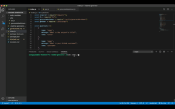

# About readme-generator

As a developer, you want a README generator application, so that you can easily put together a good README for a new project. This is a command-line application that dynamically generates a README.md from the user's input.

# Demonstration: 

# Installation
No installation needed.

# Description

This application was developed with Node.js and invoked with `node index.js.` command line. 
The user will be prompted for their GitHub username, which will be used to make a call to the GitHub API to retrieve profile image, their email, and set of questions to setup a template for a standard README.md file. 

# Feature: 
* Node.js: https://nodejs.org/en/
* Node Package Manager: https://www.npmjs.com/
* Shield.io: https://shields.io/

# Link to application:

https://github.com/iamha1/readme-generator

# Question:
If you have any questions about the repo, please contact me at: https://github.com/iamha1/

